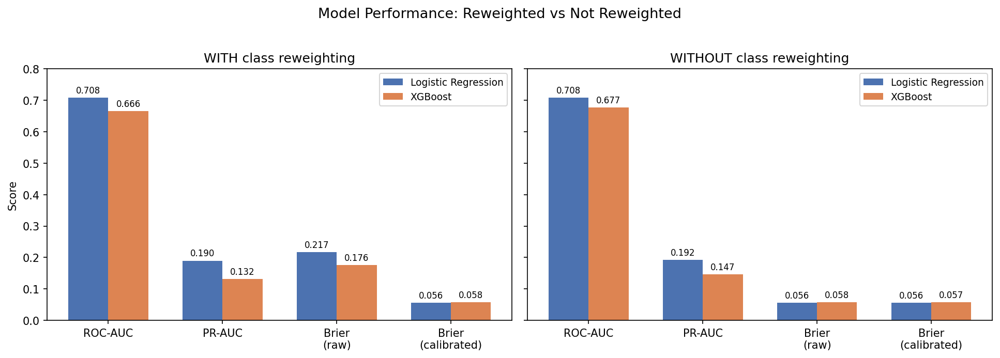
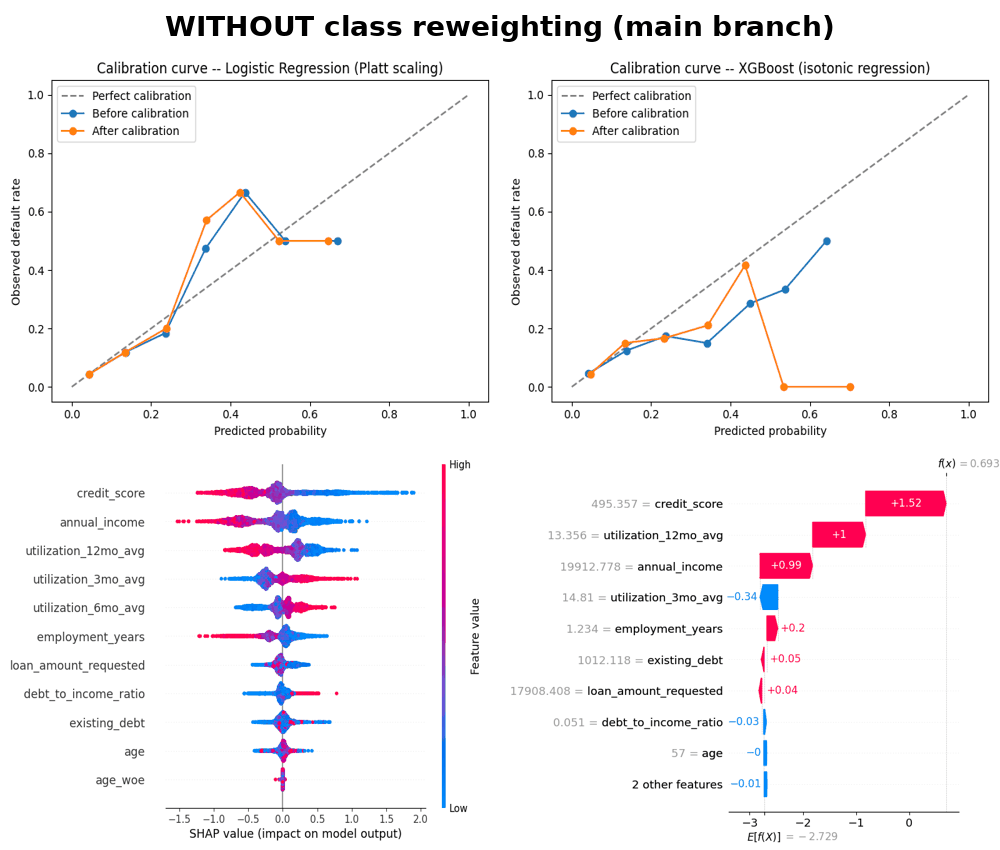

# Credit Risk Modelling - PD Scorecard & ML Pipeline

An end-to-end credit risk pipeline: data ingestion, feature engineering, model training, and deployment.

---

## Project Overview

Lenders need to decide whether to approve a loan application. This project builds a pipeline that ingests loan application data, engineers credit-risk features (DTI, Weight-of-Evidence binning, lagged utilization trends), trains and calibrates classification models, and evaluates them in both statistical and financial terms.

---

## Objectives

- Orchestrate data ingestion and quality checks with Airflow
- Engineer features through a layered dbt pipeline (staging / intermediate / marts)
- Train and calibrate interpretable models (Logistic Regression, XGBoost)
- Explain predictions with SHAP
- Monitor for data drift
- Translate model performance into financial impact
- Deploy the model as a REST API

---

## Repository Structure

```
├── dags/                    # Airflow DAG: ingest, validate, trigger dbt
├── include/dbt_project/     # dbt models (staging -> intermediate -> marts)
├── ml/                      # Model training, calibration, financial evaluation
├── monitoring/               # Drift detection (Evidently)
├── api/                      # FastAPI service + Dockerfile
├── data/                     # Synthetic data generator
├── tests/unit/                # pytest suite
└── .github/workflows/         # CI
```

---

## Methods

- **Orchestration** - Airflow (via Astro CLI)
- **Data quality** - Great Expectations
- **Feature engineering** - dbt + DuckDB (DTI ratio, WoE age binning, lagged utilization)
- **Modeling** - scikit-learn Logistic Regression, XGBoost
- **Calibration** - Platt scaling, isotonic regression (`CalibratedClassifierCV`)
- **Explainability** - SHAP
- **Drift monitoring** - Evidently AI, Population Stability Index (PSI)
- **Deployment** - FastAPI, Docker
- **Testing / CI** - pytest, GitHub Actions

---

## Results



- Logistic Regression: ROC-AUC 0.71, Gini 0.42, PR-AUC 0.19
- XGBoost: ROC-AUC 0.68, Gini 0.35, PR-AUC 0.15
- Both models calibrated (Platt scaling / isotonic regression); Brier score improved from ~0.22 to ~0.06 for Logistic Regression
- Financial impact: 39% reduction in bad debt vs. approving all applicants, at 77% approval retention for good customers
- Drift check correctly flags a simulated economic downturn (PSI 0.66 on utilization) and stays silent on unaffected features (PSI 0.0 on credit score)

Results are on synthetic data. They validate the pipeline end to end, not real-world model performance.

---

## Reweighting Experiment

`main` trains on the natural class distribution. An earlier version used class reweighting (`class_weight="balanced"`, `scale_pos_weight`) to handle the ~6% default rate, kept on the [`class-weighted-version`](../../tree/class-weighted-version) branch for comparison.



Reweighting did not improve discrimination and degraded calibration. `main` reflects the better-performing approach.

---

## Requirements

```bash
pip install -r requirements.txt
pip install dbt-core dbt-duckdb great_expectations scikit-learn xgboost shap evidently fastapi
```

---

## Usage

1. **Airflow + dbt**
   ```bash
   astro dev start
   ```
   Trigger `credit_risk_ingestion` at `localhost:8080`.

2. **Model training and calibration**
   ```bash
   python3 ml/train_model.py
   ```

3. **Financial evaluation**
   ```bash
   python3 ml/financial_evaluation.py
   ```

4. **Drift check**
   ```bash
   python3 monitoring/drift_check.py
   ```

5. **API**
   ```bash
   docker build -f api/Dockerfile -t credit-risk-api .
   docker run -p 8000:8000 credit-risk-api
   ```
   Visit `localhost:8000`.

6. **Tests**
   ```bash
   pytest tests/unit/ -v
   ```

---

## Notes

- DuckDB used instead of Postgres/Snowflake for local development
- Decision threshold (0.5) is a placeholder, not tuned to cost trade-offs
- Great Expectations checks currently log issues rather than blocking the pipeline

---

## Stack

Airflow (Astro CLI) · dbt · DuckDB · Great Expectations · scikit-learn · XGBoost · SHAP · Evidently AI · FastAPI · Docker · pytest · GitHub Actions
